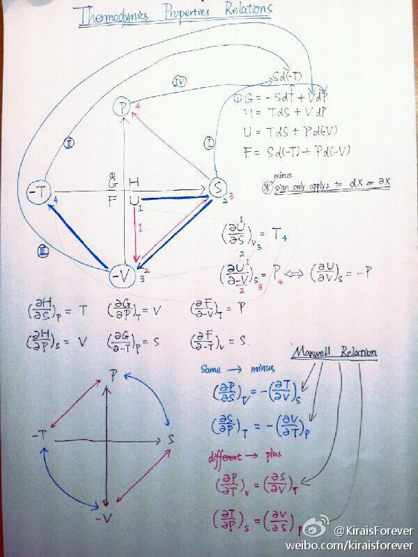
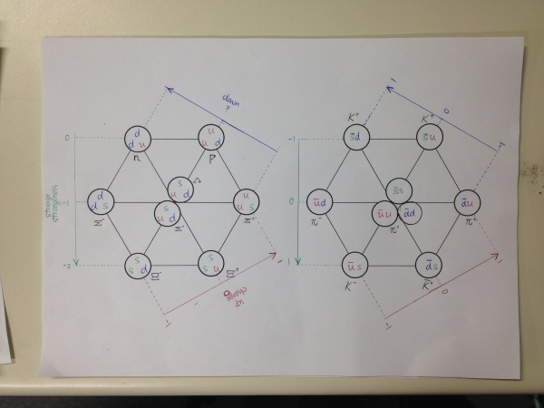

这几天参加了第八届全球华人物理学家大会\[1\]，听了很多杰出华人物理学家的报告，收益匪浅。

其中最感动的，莫过于亲身感受到只在科学家传记上看到的科学精神。

吳秀蘭教授\[2\]讲了她寻找希格斯粒子30年的奋斗经历\[3\]。从80年代开始，世界各地的高能粒子对撞机，DESY，LEP1，LEP2，Tevatron Collider等等，每隔几年就会传出发现希格斯粒子信号的报告，可是无一例外地都被后来的进一步分析所否决。直到2012年7月，位于瑞士日内瓦的大型强子对撞机（LHC）才成功获得置信区间为5个标准差的信号，正式宣布发现希格斯粒子。30年如一日地坚持同一个实验项目，绝对不是一件容易的事。那需要对物理的单纯的热爱和执著的追求。

国立台湾大学的黃偉彥教授\[4\]对物理学的执著追求更是让人感动。他十岁时发生车祸失去了右脚，大约十年前又中风令右半边的身体不能动弹，就连说话也很费劲。可是如此不幸的人生也无法阻止他对物理学的追求。他讲了自己几十年来在推广希格斯机制到强相互作用力上遇到的重重难关。一开始由于观念太新颖，期刊编辑认为希格斯机制在强相互作用力领域没有什么用，拒绝发表。后来前前后后几十年，又遇到了各种各样学术上和非学术上的困难，最终在最近几年取得一些成果。如此执著的精神，实在让人肃然起敬。

杨振宁先生和大家分享了他学习和研究的经历。我去年看过他的传记，对他的一生还算比较了解，而且杨振宁先生学术生涯一帆风顺，没有什么大的挫折，所以我并没有在他的讲话中得到特别大的启发。然而，能够听到像杨振宁先生这样对数个物理领域都取得奠基性贡献的大科学家的亲自演讲，这本身就是一种震撼。原来他不仅仅是存活在书本上“传说中”的杨振宁，而且还是活生生坐在我面前讲话的杨振宁。他的讲话结束后，我第一个向他提问：当初是为什么选物理，为什么选择搞科研。他说，那时候的时代背景不一样，出国留学的人都希望学会一些实用的东西回国做贡献。这大概就是他刚去芝加哥大学两年做实验物理的原因吧。至于为什么选择搞科研，他没有回答我。可是后来我想了一下，大概明白了。那个时代背景之下，有能力深造的人，除了搞科研——那时的中国几乎没有任何科技公司或者工程项目——也就再也没有其他出路了。

清华大学物理系教授陶嘉琳\[5\]对科学的激情和谦虚让我印象很深。她的讲话充满激情，所有繁杂的粒子物理理论在她口中都成了一首首美丽的诗歌。她说，做了暗物质研究几十年，她学会了对自然的恭敬和谦虚。所有的理论都可能是错的，做任何理论性的判断都要想清楚这个理论的所有前提和假设。

中科院物理研究所的吴令安\[6\]研究员的求学经历也让我佩服。她在英国长大，18岁回国，后来在北京大学读本科。可是从她毕业的68年到她后来找到机会出国的87年间，由于众所周知的原因，她没有在科学上做出什么贡献。可是她仍然没放弃对科学的追求，43岁时到德州大学奥斯丁分校读博士研究量子光学，用光参量谐振腔实现光压缩态，创63%压缩率纪录，文章单篇引用600多次。这告诉我，只要对科学有足够的激情和热爱，什么时候开始从事科学工作都不算迟。

另一方面，中国在高能物理和核聚变的成果和未来计划让我对中国科研水平刮目相看。

中科院高能所的高杰\[7\]、王贻芳\[8\]，分别汇报了中国下一代环形正负电子对撞机计划\[9\]、大亚湾中微子振荡实验\[10\]以及未来中微子试验计划\[11\]。核工业西南物理研究院的严龙文\[12\]和中科院等离子体物理研究所的高翔\[13\]分别汇报了现有热核聚变装置HL-2A\[14\]和EAST\[14\]的成果；中科大核科学技术学院的叶民友\[15\]和北大聚变模拟中心的王晓刚\[16\]汇报了中国聚变工程实验堆（CFETR）的建造计划\[17\]。这些已有的实验结果和未来计划，必然会让中国高能物理和核聚变的科研水平提高到国际顶尖水平。最让我感到震撼的是，这些都是需要长时间筹备，涉及大量人力物力财力的项目，能够按部就班地快速实行，实在不容易。这让我在另一个方面深刻地感受到中国现代化取得的巨大进展。这几位专家，即使有着非常了不起的数据和计划，每一个人都是谦虚地作报告，没有丝毫的趾高气昂。

这几天看到的华人物理学家科研情况和他们展现出来对科学纯粹的激情和热爱，又让我重新燃起科研的激情和希望。

这两年来做了一些材料科研，看到很多论文，以及我所做的研究，更多是机械的重复或者尝试，没有多少理论分析，甚至感觉到没有任何智力上的运用，纯粹是体力劳动。我第一次做的是喷墨3D打印机的材料制备，用普通食糖当成粘合剂，打印材料是氧化铝。用食糖做粘合剂的研究有人做过，氧化铝的3D打印也有人做过，但是没有人把这两个结合起来做过。这样的研究不能说没有任何价值，可是价值非常低，不可能有什么突破性发现。第二次做科研，是去年到东京工业大学交换时做的分子电子器件。那时候先后做了3个项目。第一个是用扫描隧道显微镜分析某些有潜在研究价值的有机分子的电学性质。因为需要分析单个分子，所以浸泡样品基板的溶液浓度不能太高。于是在显微镜下寻找单个分子的工作，就像大海捞针，只有日复一日重复的机械劳动。于是我就换了一个项目，做纳米缝隙电极器件。这个器件制造过程步骤很多，涉及的仪器也不少，对于刚进入科研的我来说相当新鲜和有用。可是这个研究的本身，我在没有任何理论分析的指导下，尝试对制备过程进行改进，没有什么进展。让我气愤的是，那个实验室明明严重依赖着制备器件的一个重要化学反应，而且这个研究已经进行了好几年，居然没有人去尝试从理论上研究影响这个化学反应速率的因素，从而实现对制备过程的精确控制。最后一个项目制造两种不同金属电极形成的纳米间隙。这个项目算是比较有前途，然而研究的实质更多的仍然是工程上的对制备过程进行“盲目的”，“直觉性”的各种调试，没有任何理论指导。这些科研经验都让我觉得，科研不需要动脑，只要学会了仪器操作，高中生甚至初中生都可以做出同样的工作。

从日本回来以后，我到了一家创业公司\[18\]实习。尽管是那么只有二三十人的小公司，里头的科研，或者说“用脑程度”远远比我之前两年在实验室做实验高得多。那里做的是很纯粹的工程，但是大家都很认真的分析问题和解决问题，因为如果问题解决不了，公司就会破产。在这种压力之下的研究，特别振奋人心。而且联想到做出来的产品可以直接给普罗大众使用，改善他们的生活，做起来的成就感也特别的强。相比之下，一般的材料工程研究，没有强大的理论支配，没有智力上的愉悦感，又不接近生活，没有直接应用带来的兴奋。所以，在这周全球华人物理学家大会之前，我已经决定要改行搞嵌入式开发，毕业后直接工作。

我一直都清楚地知道，自己非常喜欢理论物理。高二看了曹天元的《量子物理史话》，对量子力学产生了浓厚的兴趣。曹天元在书中把每一位科学家都写活了，让我觉得自己一直在他们身边，经历了整个量子革命。爱因斯坦、波尔、海森堡、泡利、薛定谔就像和我成为了好朋友似的。大一看MIT教授Walter Lewin的大学物理网络课程，也对物理产生了浓厚的兴趣。后来学了热力学，也曾经努力专研过一段时间，发现了自己独创的麦克斯韦关系式转变规律。今年看上海交大季向东教授的《粒子物理探秘》，发现八重态模型的那一晚上，看着那两个六边形，感叹了很久：这个世界是如此的复杂，然而又是如此的简单。

可是由于各种各样的原因，我从来没有认真考虑过做理论物理的研究。每当我对理论的美而感叹时，不就便被理论中繁杂的公式和数学所难倒，不敢前进。我害怕自己对理论物理的热爱仅仅停留在表面，当我真正研究下去了，恐怕就会讨厌其中涉及的众多物理和数学知识，半途而废。

不过，在创业公司实习每周至少通宵一次的经历告诉我，值得做的事大多都是困难的，需要付出极大努力的，不需要付出极大努力的，大概都不是什么值得做的事情。实习以后，我对所有科研的看法都变了，面对困难的耐性多了，没有以前那么轻易放弃。说不定，现在的我，已经具备足够的精心和耐性，去尝试研究理论物理。反正现在本科还剩下一年时间，还有很多时间去尝试去判断。

由于奖学金条约限制的缘故，本科毕业以后，我大概不能离开新加坡到其他国家念博士。前天粗略地浏览了南大和国大物理系的教授以及他们的研究，没有发现大师级教授，有点失望。大师的指导自然重要，但是缺乏大师指导并不能成为阻止我向理论物理前进的绊脚石。黃偉彥教授和吴令安研究员克服重重困难执著追求物理的精神，鼓舞着我，不要放弃。或许得到大师指导我会突飞猛进，但是即使没有大师指导，我原地踏步也得坚持下去。我的物理学家梦想不能轻易放弃，我对物理的追求不能轻易放弃。

有时也在想，要是当初大一的时候就想好做理论就好了，现在就不用努力恶补，读博士的时候就能轻松一点。可是，这就像吃了三个包子饱了，后悔没有第一口就吃第三个包子省钱。如果没有这几年我对人生和事业的各种探索，或许我就没有现在如此坚定地相信自己的选择是正确的，如此有耐心地去专研。或许现在才开始有点晚了，可是再晚也不过是晚了三年。人生还有二三十个三年可以让我弥补这失去的三年。所以这一切的顾忌，都是不必要的。最重要的是，我要确认自己对理论物理研究的激情，耐心和能力。

真希望，我可以真正和爱因斯坦、波尔成为朋友。

引用：

1.  [The OCPA8 International Conference on Physics Education and Frontier Physics](http://www.ntu.edu.sg/ias/upcomingevents/OCPA8/Pages/default.aspx)
    
2.  [Sau Lan Wu - Welcome to Professor Sau Lan Wu's homepage](https://wisconsin.cern.ch/wus/)
    
3.  [Brief history for the search and discovery of the Higgs particle – A personal perspective](http://arxiv.org/pdf/1403.4425v1.pdf)
    
4.  [黃偉彥](http://www.phys.ntu.edu.tw/member/main1.aspx?mem_id=59)[\----](http://www.phys.ntu.edu.tw/member/main1.aspx?mem_id=59)[國立臺灣大學物理學系](http://www.phys.ntu.edu.tw/member/main1.aspx?mem_id=59)
    
5.  [陶嘉琳](http://www.phys.tsinghua.edu.cn/publish/phy/6032/2011/20110307110409282930408/20110307110409282930408_.html)[\----](http://www.phys.tsinghua.edu.cn/publish/phy/6032/2011/20110307110409282930408/20110307110409282930408_.html)[清华大学物理系](http://www.phys.tsinghua.edu.cn/publish/phy/6032/2011/20110307110409282930408/20110307110409282930408_.html)
    
6.  [吴令安](http://www.iop.cas.cn/rcjy/zgjgwry/?dir=zgjgwry&t=detail&id=409)[\----](http://www.iop.cas.cn/rcjy/zgjgwry/?dir=zgjgwry&t=detail&id=409)[中国科学院物理研究所](http://www.iop.cas.cn/rcjy/zgjgwry/?dir=zgjgwry&t=detail&id=409)
    
7.  [高杰](http://sourcedb.ihep.cas.cn/zw/zjrc/ds/hjsjyy/201006/t20100613_2882342.html)[\----](http://sourcedb.ihep.cas.cn/zw/zjrc/ds/hjsjyy/201006/t20100613_2882342.html)[中国科学院高能物理研究所](http://sourcedb.ihep.cas.cn/zw/zjrc/ds/hjsjyy/201006/t20100613_2882342.html)
    
8.  [王贻芳](http://sourcedb.ihep.cas.cn/zw/zjrc/ds/lzwlyyzhwl/201006/t20100613_2882198.html)[\----](http://sourcedb.ihep.cas.cn/zw/zjrc/ds/lzwlyyzhwl/201006/t20100613_2882198.html)[中国科学院高能物理研究所](http://sourcedb.ihep.cas.cn/zw/zjrc/ds/lzwlyyzhwl/201006/t20100613_2882198.html)
    
9.  [下一代高能正负电子对撞机：现状与对策](http://www.xssc.ac.cn/ReadBrief.aspx?ItemID=1055)
    
10.  [大亚湾反应堆中微子实验简介](http://dayabay.ihep.ac.cn/chinese/gcgk/syjj/index.shtml)[\----](http://dayabay.ihep.ac.cn/chinese/gcgk/syjj/index.shtml)[大亚湾反应堆中微子实验工程](http://dayabay.ihep.ac.cn/chinese/gcgk/syjj/index.shtml)
    
11.  [江门中微子实验简介](http://www.ihep.cas.cn/dkxzz/juno/JUNO_gaikuang/201308/t20130802_3908078.html)[\----](http://www.ihep.cas.cn/dkxzz/juno/JUNO_gaikuang/201308/t20130802_3908078.html)[中国科学院高能物理研究所](http://www.ihep.cas.cn/dkxzz/juno/JUNO_gaikuang/201308/t20130802_3908078.html)
    
12.  [严龙文](http://www.swip.ac.cn/rcpy/BD04YLW.HTM)[\----](http://www.swip.ac.cn/rcpy/BD04YLW.HTM)[核工业西南物理研究院](http://www.swip.ac.cn/rcpy/BD04YLW.HTM)
    
13.  [高翔](http://www.ipp.cas.cn/rcdw/cxtd/201212/t20121230_104180.html?randid=0.24569575956403267.html)[\----](http://www.ipp.cas.cn/rcdw/cxtd/201212/t20121230_104180.html?randid=0.24569575956403267.html)[中国科学院等离子体物理研究所](http://www.ipp.cas.cn/rcdw/cxtd/201212/t20121230_104180.html?randid=0.24569575956403267.html)
    
14.  [聚变装置](http://www.iterchina.cn/jbzz/)[\_](http://www.iterchina.cn/jbzz/)[中国国际核聚变能源计划执行中心](http://www.iterchina.cn/jbzz/)
    
15.  [叶友文](http://dsxt.ustc.edu.cn/zj_js.asp?zzid=3517)[\----](http://dsxt.ustc.edu.cn/zj_js.asp?zzid=3517)[核科学技术学院](http://dsxt.ustc.edu.cn/zj_js.asp?zzid=3517)
    
16.  [王晓钢](http://www.phy.pku.edu.cn/fsc/c57699.jsp)[\----](http://www.phy.pku.edu.cn/fsc/c57699.jsp)[北京大学聚变模拟中心](http://www.phy.pku.edu.cn/fsc/c57699.jsp)
    
17.  [中国聚变工程实验堆（](http://www.phy.pku.edu.cn/fsc//admin/fileadmin/upfile/0423/1366964305951.pdf)[CFETR)](http://www.phy.pku.edu.cn/fsc//admin/fileadmin/upfile/0423/1366964305951.pdf)[总体设计](http://www.phy.pku.edu.cn/fsc//admin/fileadmin/upfile/0423/1366964305951.pdf) [——](http://www.phy.pku.edu.cn/fsc//admin/fileadmin/upfile/0423/1366964305951.pdf) [进展和挑战](http://www.phy.pku.edu.cn/fsc//admin/fileadmin/upfile/0423/1366964305951.pdf)
    
18.  [Pirate3D](http://pirate3d.com/)