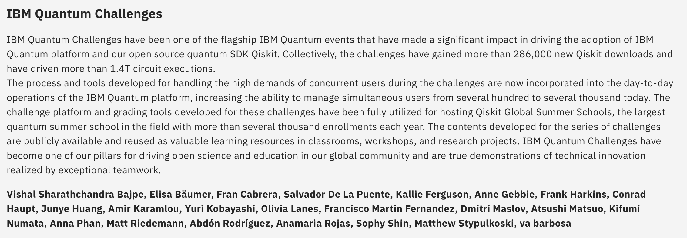
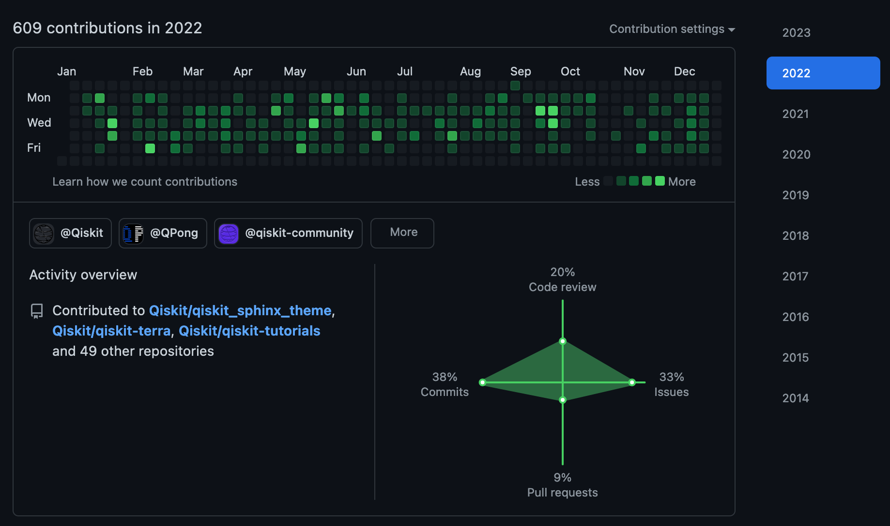
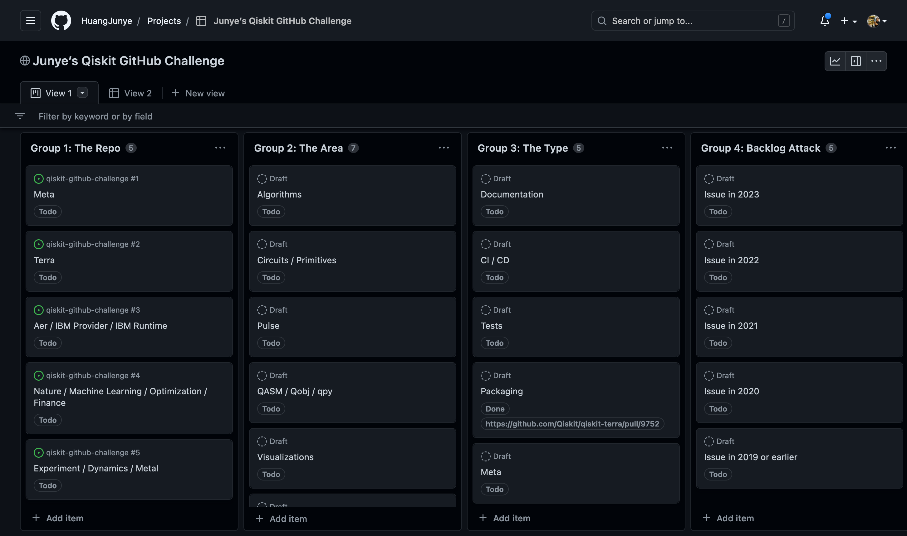
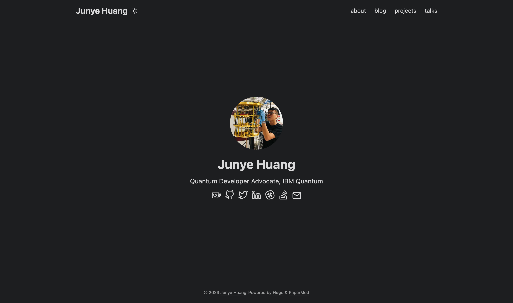

It's that time of the year again. Today is my third working anniversary (actually I am exactly 1 week late). It's hard to believe that it has been 3 years since I started working at IBM Quantum. But at the same time, the last 3 years felt like a lifetime, I guess it's not just for me, but also most people in the world. When I started working in March 2020, COVID just started and no one could anticipate that it would evolve into a global pandemic. Well, the good news is that, 3 years later, we have learned to live with it and things are getting back to normal though the "norm" will never be the same.

I wrote [a blog post]() for my 1-year working anniversary. I was planning to write every year. In fact, I wrote a draft last year but I got lazy and the post never made it to the light. On the bright side, I have more things to say today :D.

## Highlights

Just like last time, let's start with some bullet points highlights (because bullet points are way easier to write than paragraphs!).

- **Moved to Spain.** Moving across continents was not an easy task. But now that I have settled, I am happily living in Spain. 
	- One big perk I get is extra pairs of hands to help raise my daughter now that I live in the same city as my in-laws. 
	- Spanish people are friendly. Daily interactions with strangers and acquaintances are much more pleasant than in Singapore even though speaking Spanish is still a challenge for me. 
	- Another huge benefit is the time zone. In Singapore, I often need to work from 9 pm till midnight because most meetings happen in the US morning time, whereas the same meetings happen in Europe afternoons. Therefore I can work normal hours in Spain, disconnect from work and have a much better work-life balance.



- **Changed team**, from APAC community team to Qiskit Developer Advocacy team, still under the same, broader IBM Quantum Community Team. Now I work less on events and more with code and content.
- **Led the team behind [IBM Quantum Challenge May 2021](https://research.ibm.com/blog/quantum-challenge-2021-results).** Learned a ton of things about leading a big cross-functional team. It is still one of my biggest (if not the biggest) achievements to date. For this and involvement in other challenges, I received IBM Research Accomplishment Award in 2022.

- **Created [Qiskit Advocate Mentorship Program (QAMP)](https://github.com/qiskit-advocate/qamp-general).** I am so happy to see many advocates learn new skills and formed meaningful relationships with their mentors through this program. Also, there are a lot of cool projects that came out of the program, including [Qiskit Ecosystem](https://github.com/qiskit-advocate/qamp-fall-21/issues/6), [qiskit-braket-provider](https://github.com/qiskit-advocate/qamp-spring-22/issues/6) and a few academic papers [1](https://arxiv.org/abs/2110.15221), [2](https://arxiv.org/abs/2210.08574), [3](https://arxiv.org/abs/2203.12943), [4](https://arxiv.org/abs/2301.11725).
- **Revisited QPong.** If you know me, you probably know that QPong played an important role in getting me into IBM Quantum. So I was really happy to revisit it after a few years. In 2022, I mentored three Qiskit advocates under QAMP to work on [QPong 2.0](https://github.com/qiskit-advocate/qamp-fall-22/issues/26) and did a [two](https://youtu.be/C-tCZAC1Qq8)-[part](https://youtu.be/PYthycN_Tq8) live stream series on creating QPong from scratch.
- **Mentored intern Guillermo for [his Master thesis](https://twitter.com/HuangJunye/status/1605516004834033665?s=20).** I have been focusing on developing software engineering skills since joining IBM Quantum so it was a bit of a nostalgic trip as a mentor for Guillermo's thesis. I am proud of what Guillermo has done, but I can't say that miss doing research :D. 
- **Created [Qiskit Docs Guide](https://qisk.it/docs-guide)** with Guillermo. It's an important document to help Qiskit developers create high-quality documentation. I learned a lot about writing documentation and using Sphinx in the process.
- **Obtained [Open Source Strategic Committer badge](https://www.credly.com/badges/b510ad82-d948-4a00-84e4-abe48b6257ce) and Technical Collaboration Achievement Program (TCAP) award.** Most of my daily work now is about open source. Through documentation work and helping external contributors, I obtained write access to qiskit-meta, qiskit-terra and maintainer access to qiskit-tutorials and qiskit_sphinx_theme. I also contributed a few code PRs to qiskit-terra outside of my usual work scope. Among them I am most proud of the PR to migrate fake backends from qiskit.test.mock to qiskit.providers.fake_provider. I hope this year I will contribute more code PRs to Qiskit.
- I earned the [second like](https://twitter.com/HuangJunye/status/1426565775695831045/likes) (the first like [here](https://twitter.com/HuangJunye/status/1310765609769029632?s=20)) from Peter Shor by posting a joke of vi and emacs.
- More fun stuff. I made pineapple tarts with the Qiskit logo design after the Chinese New Year in 2021.



## What have I learned?

In addition to learning how to lead and work in a big cross-functional team through quantum challenges (as mentioned above), I learned how to write technical documentation and how to use Sphinx to build documentation. Overall, I learned a lot about how to work using GitHub: triaging issues, making pull requests, reviewing code, setting up workflows, etc. These are transferable skills that I can use in any open-source projects in the future. GitHub generally makes features developer-friendly so it's often a pleasure to use its tools.

*My GitHub quadrant is way more balanced in 2022 than in 2021*

One thing I tried hard to learn and apply but didn't work well was Agile methodologies. The principles make sense and the practices (like retrospectives) can be useful, but as a whole, it's not suitable for my job as a developer advocate. My job scope changes often and I usually work on multiple projects at the same time. It is hard to enforce Agile strictly, both on the personal level and on the project level. In fact, my productivity dropped when I was applying Agile more strictly. In theory, putting everything in the backlog and waiting until planning to assess and prioritize makes total sense and reduces the stress. In practice, for many tasks, it takes more effort and time to assess and prioritize than to do them. Plus, deferring tasks to be accessed and done later loses momentum and excitement and as a result, I am less motivated to do them. I think it's just like everything in the world, the way of working needs to be balanced. Working completely spontaneously is not sustainable, but working in a strictly Agile way is not productive either. 

## Challenges

I guess you can imagine that moving across continents and changing teams was not an easy task. Indeed, I had to learn how to live in a new country, speak a new language and work in a different area. For a while, it was quite challenging. For a while, I felt that I was not doing a good job in my new team, especially in comparison to my superstar teammates (yes, I am talking about you, Abby and Iskandar!). In addition, it also took me a while to adapt to doing works that are more continuous and less visible than more intensive and more visible works like quantum challenges that I was used to.

Related to that is the feeling of being small and replaceable as part of a big endeavour. Making quantum computing a thing is a huge challenge, even for a big company like IBM as a whole, let alone for each individual within it. It is easy to feel that your daily work is disconnected from the big picture. It is even easier to feel that your work is trivial when you are working as a developer advocate. It is easy to feel that correcting a typo in a doctoring of an obscure function in Qiskit does not contribute to achieving quantum advantage. It is easy to feel that all the important work are done by researchers. 

This feeling is not new the last two years. I have had that feeling ever since I dropped out from PhD and started this job. I don't have an ultimate solution to that, but thinking about these points helps me better:

- In any job role, there is mundane stuff as well as exciting stuff, trivial stuff as well as important stuff.
- All job roles are important, indeed some are more important than others, but all play a part in making something great together.
- It's important to find small joy in day-to-day work.
- From time to time, remind yourself of the big picture, and why you are doing what you do.
 
## What do I look forward to?

### Qiskit Providers

One thing I am particularly excited about working on this year is promoting the fact that Qiskit is vendor agnostic, that it doesn't only support IBM Quantum Platform, but also other hardware, simulators and platforms including our competitors like Amazon Braket and Azure Quantum. 

As a first step towards that, I am working with front-end developers to put out a new providers page on the qiskit.org website to highlight the existing providers and vendors Qiskit supports. Through the process of gathering the providers information, I am surprised myself by the sheer number of providers Qiskit already supports. I am sure the new providers page will help people discover various Qiskit providers and also motivate vendors to develop new providers for Qiskit.

### Qiskit GitHub Challenge

This is more just for fun and for self-development. Inspired by a [gaming challenge](https://discuss.grouvee.com/t/2021-grouvee-challenge-how-to-instructions/6955) that is designed to tackle game backlog, I [designed a challenge](https://github.com/users/HuangJunye/projects/2/views/1) for myself to make at least 20 pull requests that fulfill the different category requirements.

Similar to tackling gaming backlogs, sometimes it's difficult to decide on which issue to work on for an open-source contribution. These challenge categories help me narrow down the issues to tackle and also make the process a bit more fun and force me to discover something that I normally wouldn't work on.

If you find this interesting, feel free to duplicate the project board and start your own Qiskit GitHub Challenge!

## New Personal Website

To celebrate the work anniversary, I migrated my personal website from Jekyll to Hugo (inspired by https://pradyunsg.me/). The build is lightning fast. It takes only 103 ms to build the entire site and only 16s to deploy the pages using GitHub workflow. I love the [PaperMod theme](https://github.com/adityatelange/hugo-PaperMod/). When I get some time, I will work on other pages of the website.

## Official Celebration Page

Lastly, I want to share my 3-year IBM Service Anniversary [celebration page](https://ibmrr.performnet.com/ibmrr/celebrationRecipient.do?clientState=IxWdHbAWxIUMwmIJJX6mdUKXzCMz4cxX0iIfJZBRLoyOzifglzuy7e8tJmg1SSjjMz%2BBM2KXMHxc%0A6YvTP1ULF4pidE7jAxG1r7Z1wdGoL%2BkFJP7cgoG9HnBUseYV9rpPsWxRjoEL0epJhBQFtqKYhoiQ%0AhkPoUUi1dLqpq7K73thKgNv73utSvta%2BOcxRQiHxCyZSZYnTU3eXTNhl&cryptoPass=1). I didn't expect to receive so many heart-warming messages from colleagues. Thank you very much for making this job so awesome!

## Epilogue

Whenever I write a blog post, I am simultaneously enjoying it and hating it at the same time (like superposition XD). I enjoy the feeling of articulating my thoughts through writing but at the same time, I dread at writing and re-writing because the sentences coming out of my brain often don't make sense. Last time I said, "writing feels so great, let's write once a month!". This time I am older and getting a bit wiser. I am not going to promise to write anything. Maybe, I will write another of this work anniversary post in a year or two, just maybe. No promise. Until next time, take care!